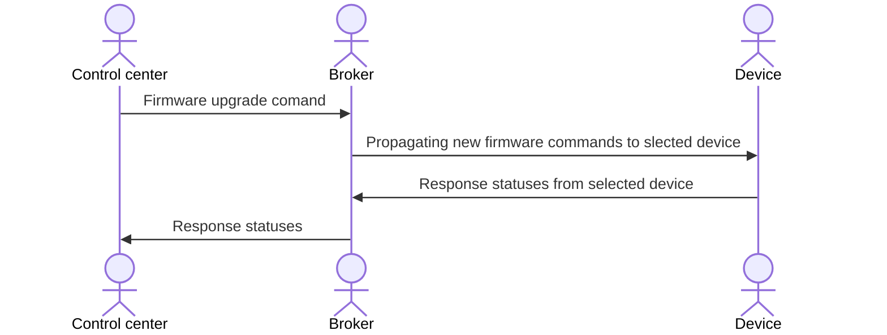

# fota-micropython
Firmware upgrades Over The Ait (FOTA) written in MicroPython for fun!

## Motivation
Inside my home automations and all IoT prototypes, I would like to have firmware updates Aver The Air (FOTA).
Reasons are pracical: no physical connections by wires is required with this scenario with any IoT device. 
With below code we have one impoetant feature: `we can managed firmware upgrades automation with easy steps`.

### Main data flow

### How to install

TBD

### Specification

TBD

### What happen in case of errors in FOTA process?

TBD
