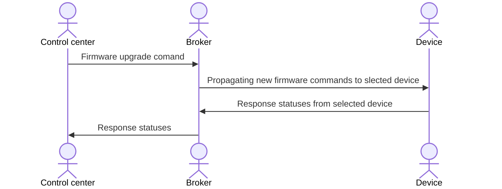

# fota-micropython
Firmware upgrades Over The Ait (FOTA) written in MicroPython for fun!

## Motivation
In my journey of building home automation systems and IoT prototypes, one thing is clear—firmware updates should be effortless and wireless.
Over-The-Air (FOTA) updates eliminate the need for physical connections, making device management smarter and more efficient.

With this project, we unlock a key feature: `automated firmware upgrades with just a few simple steps - no manual intervention required!`.
Say goodbye to tangled cables and complex update processes, and embrace a streamlined, hands-free approach to keeping IoT devices up to date.

### Why FOTA is Crucial in IoT
- Security Enhancements – IoT devices are frequent targets for cyberattacks. FOTA enables timely security patches to protect against vulnerabilities.

- Bug Fixes & Performance Improvements – Devices can encounter software glitches or inefficiencies; FOTA allows remote fixes without manual intervention.

- Feature Updates – As IoT ecosystems evolve, manufacturers can roll out new functionalities, extending the lifespan of devices.

- Device Lifecycle Management – Without FOTA, outdated firmware would require physical servicing, leading to operational inefficiencies.

- Cost Efficiency – Eliminates the need for on-site maintenance and reduces operational downtime.

- Scalability – With IoT deployments often spanning thousands or millions of devices, centralized firmware management ensures smooth operations.

- Compliance & Standards – Regulatory requirements frequently change; FOTA allows devices to stay compliant without costly recalls.

### Hard Parts Behind FOTA Implementation
- Reliable Connectivity – IoT devices might operate in areas with weak or intermittent networks, making firmware delivery challenging.

- Power Constraints – Battery-operated devices need optimized update processes that don’t drain power.

- Security Risks – Unauthorized firmware updates could compromise devices, necessitating strong encryption and authentication protocols.

- Storage Limitations – Many IoT devices have limited memory, requiring careful update packaging and efficient installation mechanisms.

- Rollback & Recovery Mechanisms – If an update fails, devices must be able to revert to previous firmware versions without bricking.

- Bandwidth Optimization – Large-scale updates can strain networks, requiring intelligent scheduling and differential update mechanisms.

- Diverse Hardware Architectures – Different IoT devices use various processors and firmware structures, making universal updates complex.

### Main data flow

### How to install

TBD

### Specification

TBD

### What happen in case of errors in FOTA process?

TBD
